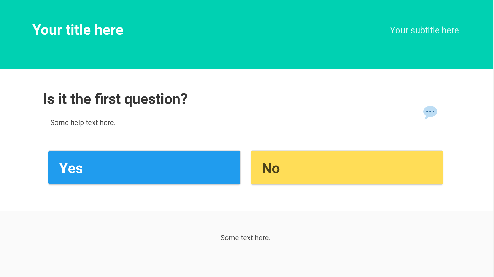

# `Choices`

`Choices` lets you build a single page application to let users traverse
a set of related options and get feedback from their choices.

# Build

1.  Copy `config-example.yml` to `config.yml` and adapt it to your needs
2.  Test your configuration with `clj -A:test` or `lein test`
3.  Compile with `clj -A:js` or `lein fig:min`
4.  Your static files are ready in `resources/public/`

# Develop

1.  Copy `config-example.yml` to `config.yml` and adapt it to your needs
2.  Compile with `clj -A:fig` or `lein fig:build`
3.  Check your web browser on <http://localhost:9500>

# Usage

Here are some examples where `Choices` is used:

-   <https://guide-juridique-logiciel-libre.etalab.gouv.fr/>
-   <https://guide-juridique-open-data.etalab.gouv.fr/>
-   <https://publiccodenet.github.io/assessment-eligibility/>

# Contribute

Contributions are welcome.  You can send feedback and patches to
[~bzg/dev@lists.sr.ht](mailto:~bzg/dev@lists.sr.ht).  For patches, please configure your local copy
of the repository to add a prefix to the subject line of your emails:

    ~$ git config format.subjectPrefix 'PATCH choices'

# Support the Clojure(script) ecosystem

If you like Clojure(script), please consider supporting maintainers by
donating to [clojuriststogether.org](https://www.clojuriststogether.org).

# License

2019-2023 Bastien Guerry

This application is published under the [EPL 2.0 license](LICENSE).

